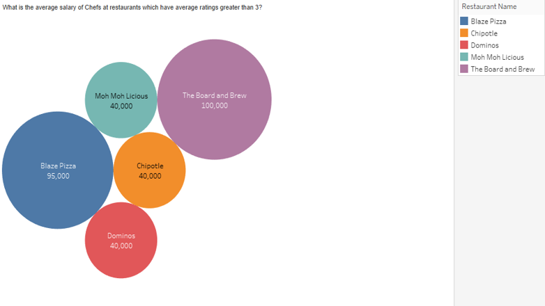

## Terpilicious Eats
_#FeartheFood_
 
## Mission Statement:

To offer an informative online platform that provides useful data and information for both customers and restaurants to help make optimal food decisions around the University of Maryland, College Park.

## Mission Objectives:

 - Provide, maintain and improve useful data and information about restaurants and customer preferences in College Park, MD
- The platform shall help users make restaurant decisions based on ratings and reviews from customers about their restaurant experiences, which can also help restaurants to improve their services and offers
-	Increase public awareness and knowledge with the goal of helping people make informed food decisions
-	Connect students, faculty, and other residents with local restaurants, and vice versa

 ## ER MODEL:

  

 ## Question:

  

 ## Visual:

  

 

